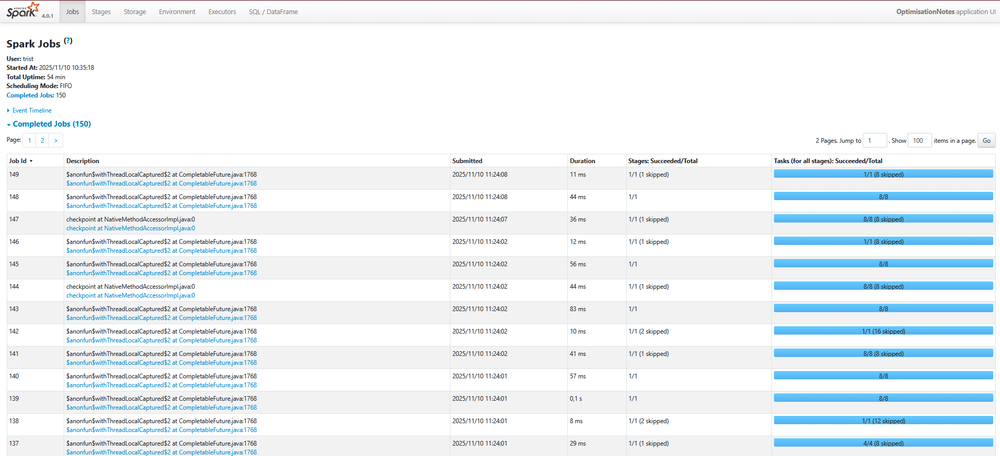
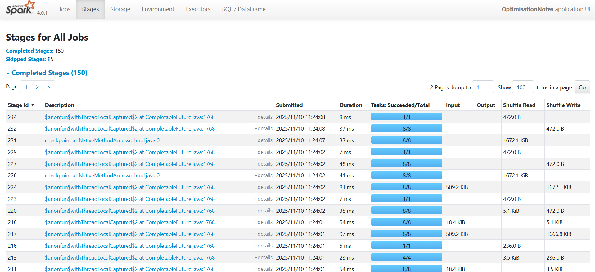
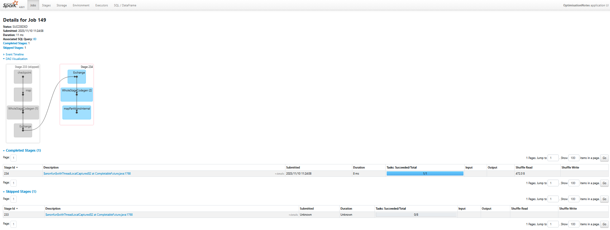

# Lab 3 : Optimisation PySpark - Rapport d'Analyse

**Date :** 10 novembre 2025  
**Projet :** Traitement distribué de données avec PySpark  
**Objectif :** Optimiser les performances par le partitionnement et assurer la tolérance aux pannes

---

## Objectifs du Lab

Ce lab vise à :
1. **Tester plusieurs niveaux de partitionnement** (2, 4, 8 partitions)
2. **Observer et comparer les temps d'exécution** pour identifier la configuration optimale
3. **Implémenter un checkpoint** pour assurer la tolérance aux pannes

---

## 1. Contexte et Données Utilisées

### Source des données
- **Fichier** : `logs_hourly.parquet` (généré dans le Lab 2)
- **Contenu** : Logs web agrégés par heure et par utilisateur
- **Format** : Parquet (format optimisé pour Spark)

---

## 2. Tests de Partitionnement

### 2.1 Méthodologie

Pour chaque niveau de partitionnement testé (2, 4, 8), nous avons :
1. **Repartitionné** le DataFrame avec `repartition(n)`
2. **Supprimé le cache** avec `unpersist()` pour éviter les biais
3. **Exécuté un count()** pour forcer le calcul
4. **Mesuré le temps d'exécution** avec le module `time`
(Voir fonction dans le fichier `lab_3/optimisation_notes.ipynb`)

### 2.2 Résultats des Tests

#### Test avec 2 partitions
```
============================================================
Test avec 2 partitions
============================================================
Nombre d'enregistrements       : 119,946
Nombre de partitions           : 2
Enregistrements par partition  : ~59,973
Temps d'exécution              : 0.12 secondes
============================================================
```

---

#### Test avec 4 partitions
```
============================================================
Test avec 4 partitions
============================================================
Nombre d'enregistrements       : 119,946
Nombre de partitions           : 4
Enregistrements par partition  : ~29,986
Temps d'exécution              : 0.15 secondes
============================================================
```

---

#### Test avec 8 partitions
```
============================================================
Test avec 8 partitions
============================================================
Nombre d'enregistrements       : 119,946
Nombre de partitions           : 8
Enregistrements par partition  : ~14,993
Temps d'exécution              : 0.16 secondes
============================================================
```

---

### 2.3 Comparaison des Performances

```
============================================================
RÉSUMÉ DES PERFORMANCES
============================================================
2 partitions : 0.12s
4 partitions : 0.15s
8 partitions : 0.16s
============================================================

Meilleure configuration : 2 partitions
============================================================
```

---

## 🛡️ 4. Checkpoint pour Tolérance aux Pannes

### 4.1 Pourquoi utiliser un checkpoint ?

Le checkpoint permet de :
- **Sauvegarder l'état** du DataFrame sur le disque
- **Récupérer après une panne** sans tout recalculer
- **Couper les dépendances** du lineage (évite les RDD trop longs)

### 4.2 Implémentation

#### Configuration du répertoire de checkpoint
```python
checkpoint_dir = "./checkpoint"
os.makedirs(checkpoint_dir, exist_ok=True)
spark.sparkContext.setCheckpointDir(checkpoint_dir)
```

#### Application du checkpoint
```python
df_checkpointed = dataframe_8_partitions.checkpoint()
```

### 4.3 Résultats

```
Répertoire de checkpoint configuré : ./checkpoint
Checkpoint appliqué sur le DataFrame
Nombre de partitions : 8
Nombre d'enregistrements : 119,946
```

---

## 5. Captures d'écran Spark UI

### 5.1 Vue des Jobs

**[]**

Cette capture montre :
- Les différents jobs exécutés (un par test de partitionnement)
- Le temps d'exécution de chaque job
- Le statut (Success/Failed)

---

### 5.2 Vue des Stages

**[]**

Cette capture illustre :
- Les stages de chaque job
- Le nombre de tâches par stage
- La distribution du temps d'exécution

---

### 5.3 DAG Visualization

**[]**

Le graphe DAG (Directed Acyclic Graph) montre :
- Le flux d'exécution des transformations
- Les étapes de shuffle (exchange)
- Les opérations de repartitionnement

---

**Fin du rapport**
